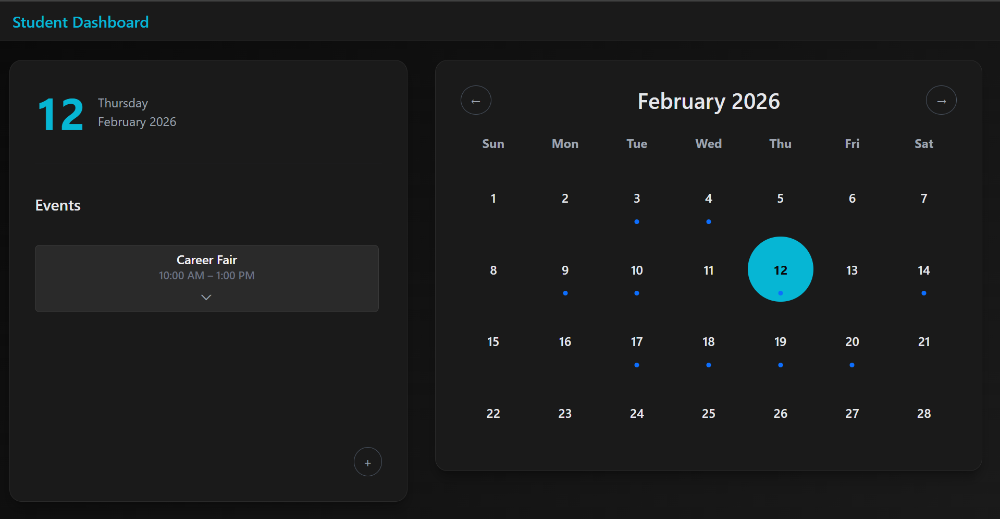
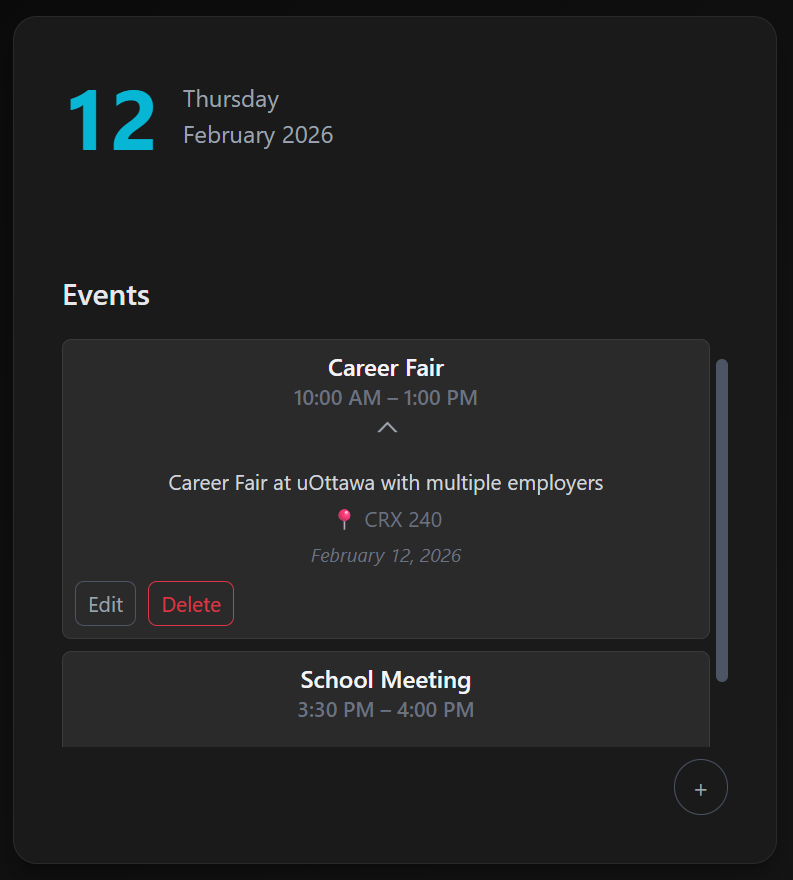
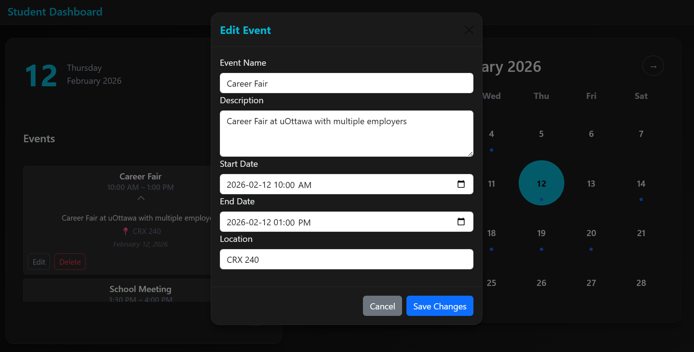

# Student Dashboard

A responsive, dark-themed student planning dashboard built with vanilla JavaScript and Bootstrap. The app provides an interactive calendar where users can create, edit, and manage events with validation and persistent local storage.

## Features

- Monthly calendar view with dynamic navigation
- Sidebar displaying selected day details
- Add events with title, description, location, and start/end date & time
- Edit and delete events
- Client-side validation (required fields, length checks, date logic)
- Visual indicators for dates containing events
- Persistent storage using localStorage
- Custom dark theme styling

## UI Preview

### Calendar View

### Event Sidebar

### Edit Event Modal

## Tech Stack

- HTML, CSS, JavaScript
- Bootstrap
- Browser localStorage API

## Architecture Overview

The app is structured around three main components:

1. **Calendar Grid**  
   Dynamically generates days for the selected month, including trailing days from adjacent months. Highlights today, the selected date, and dates with events.

2. **Event Sidebar**  
   Displays all events for the selected date, sorted chronologically. Uses reusable templates and supports collapsible event details.

3. **Modal-Based CRUD System**  
   Add, edit, and delete events via modals. All operations update the in-memory events array, localStorage, calendar UI, and sidebar UI.

## Running the Project

1. Clone the repository  
2. Open `index.html` in your browser  

No installation required.

## Future Improvements

- Recurring events
- Export/import calendar data
- Backend integration and user authentication

